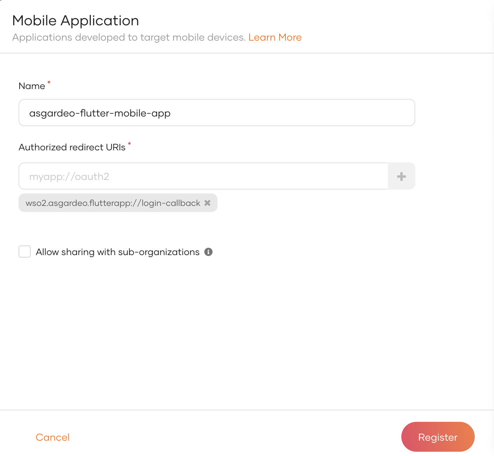
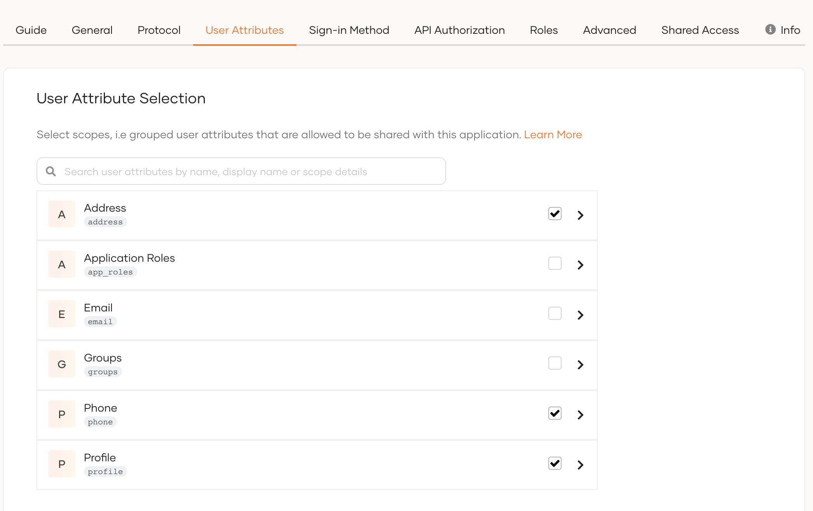
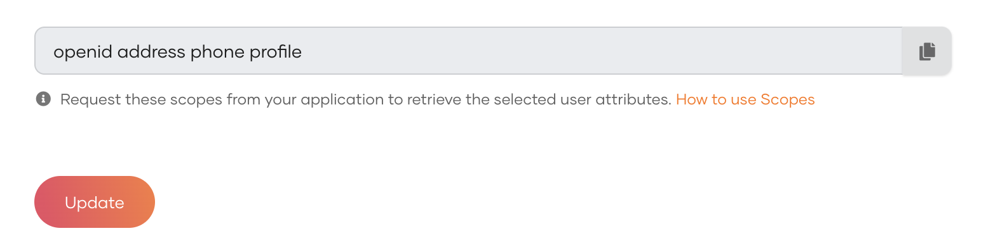
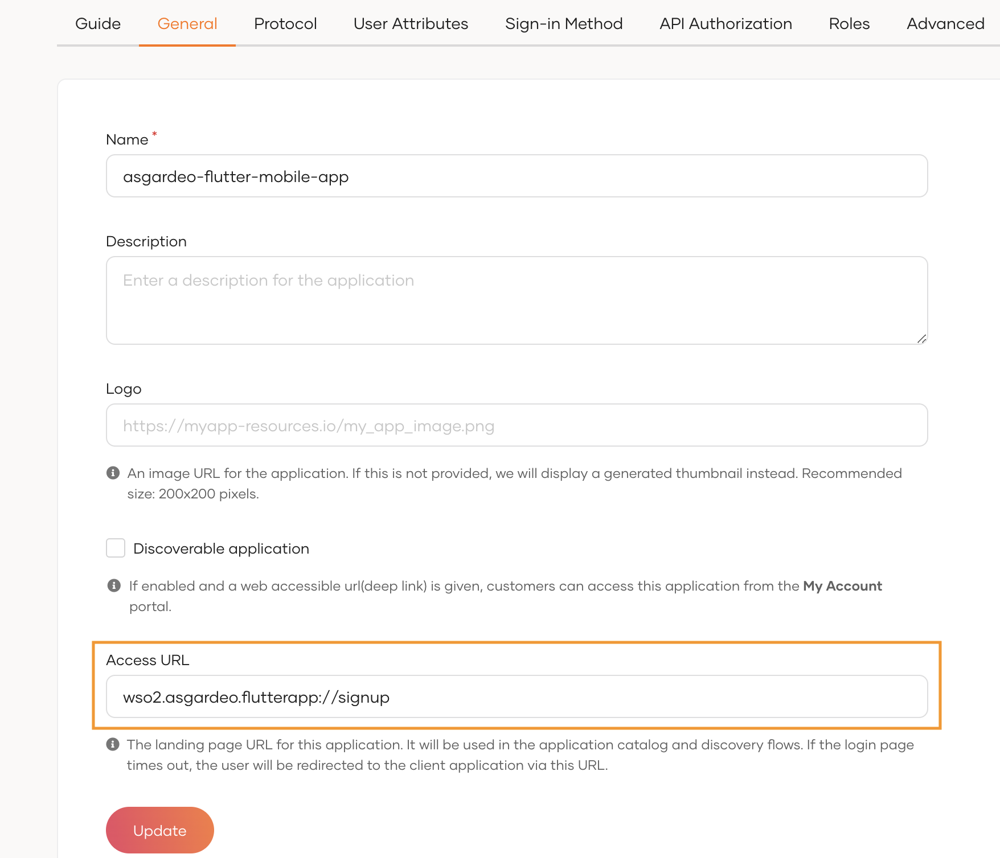

# asgardeo-flutter-b2c-sample-app

A Flutter mobile application integrated with Asgardeo. This can be used as a reference implementation to build a mobile application with Flutter.
Developers can use this as a boilerplate to build an app from scratch or as a reference to find the respective code snippets.

### Features
- User sign-up
- User sign-in
- Sign-out
- Secured External API calling
- View the user profile
- Edit the user profile

## Prerequisites

### Install Flutter
Follow Flutter Installation [Documentation](https://docs.flutter.dev/get-started/install) to Install flutter.

This application is tested with Flutter version **3.10.4** and following versions of the dependencies

`http` - 0.13.5

`flutter_appauth` - 4.2.1

`webview_flutter` - 4.2.2

`provider` - 6.0.5

`logger` - 2.0.1

These dependencies and the versions are available at *asgardeo-flutter-boilerplate-app/pubspec.yaml* file.

Compatible versions of the above dependencies may change with the Flutter version

### Setup IDE for Development
You can use one of the following IDEs for development

- Android Studio
- Intellij IDEA
- Visual Studio

### Setup Mobile Device or an Emulator
You can use one of the following options to try out the mobile application

- Connect your mobile device to the computer via USB and your OS will detect the plugged-in device. Make sure to enable development mode on your mobile device.
- Use Android Studio Emulator - If you have Android Studio installed then you can use this.
- Use iPhone emulator in MacOS - If you have a Macbook, then you can install XCODE and use this emulator

## Setup the Asgardeo Application
1. Access Asgardeo at [https://console.asgardeo.io/](https://console.asgardeo.io/) and log in.
2. Click **Applications** in left navigation menu and then select **Mobile Application**
3. Create a new Mobile Application. Fill the details and click **Register**.
    - Name: asgardeo-flutter-mobile-app
    - Authorized Redirect URLs: *wso2.asgardeo.flutterapp://login-callback* (Use the Add New option)

   See [documentation](https://wso2.com/asgardeo/docs/guides/applications/register-mobile-app/#register-the-app) for more details.




4. Configure User attributes in the Application’s User Attributes tab.
   Make sure to select following user attributes
- Country attribute  in Address
- Mobile attribute in Phone
- First Name, Last Name, Photo Url, username attributes in Profile



5. Add following scopes as the required scopes in the Application’s User Attributes tab.
   Required scopes:

openid address phone profile



6. Configure Access URL In Application’s General Tab.
   **Access URL**: *wso2.asgardeo.flutterapp://signup*



## Getting started with the Mobile Application

1. Clone this Git repository.

`git clone https://github.com/Dinithi-Hasanika/Asgardeo-Flutter-APP.git`

2. Update configurations in the file `<project>/lib/configs/configs.dart` in the flutter project

```
const clientId = '<Application-client_id>'; // client Id of the application
const redirectUrl = 'wso2.asgardeo.flutterapp://login-callback'; // application redirect url
const organizationName = '<Asgardeo-organization-name>'; // your asgardeo organization name
const spName = '<Application-name>'; // application name 
const externalAPIEndpoint = '<external-api-url>'; // external sample rest api url here if you want to call a rest API with bearer access token
const accessURL = 'wso2.asgardeo.flutterapp://signup'; // configured access URL

//optional
const defaultPhotoURL = '<default-photo-url>'
```

The specified default photo in the above configs will be shown in the user profile if the user has not added any photo URL.

3. Run following command to download the dependencies

`flutter pub get`

4. Run the flutter application with the following command in flutter terminal

`flutter run`

## Build your own application

When integrating this application as the base for your business application, you may need to make specific modifications to align it with your unique requirements.
This process may involve removing certain existing features and styles while introducing new styles and components tailored to your specific use cases.

### Remove Styles and Add your own Styles

Do Following value changes in `<project>/lib/configs/configs.dart` file as per your preference.

- Set Primary Color - Change hexa value of **primaryColor** constant
- Set Button Radius - Change button radius **buttonRadius** constant

For other widget style changes, you need to change them from the relevant widgets.

### Remove Components

Steps to remove Edit User profile option available in this application.

1. Remove Edit Profile button widget available in the View User Profile page. Then the app users will not have access to edit the profile.
2. To remove source code, remove page Index condition for edit user profile page available in MyApp Class.

`<project>/lib/pages/my_asgardeo_app.dart` -> MyApp Class -> build function -> Scaffold widget -> body

Remove following condition

```
: pageIndex == AppConstants.editProfilePage
            ? const SingleChildScrollView(child: EditProfilePage())
```

3. Remove import statements of <project>/lib/pages/edit_profile_page.dart of in <project>/lib/pages/my_asgardeo_app.dart
   `import 'edit_profile_page.dart';`

4. Remove `<project>/lib/pages/edit_profile_page.dart`

### Add New Components
Steps to add a new component.

1. Create a <new_page_name>.dart file in <project>/lib/pages.
2. Import <new_page_name>.dart file to `<project>/lib/pages/my_asgardeo_app.dart` file
3. Define page Index to new page in  `<project>/lib/constants/app_constants.dart` file

`static const int newPage = 7;`

4. Add button widget to relevant existing page and upon clicking button set Page Index of the new page calling the `CurrentPage` provider.

For more details refer `CurrentPage` provider implementation in `<project>/lib/providers/page.dart`

5. Add page Index to the existing conditional statement to render new page in

`<project>/lib/pages/my_asgardeo_app.dart` -> MyApp  Class -> build function -> Scaffold widget -> body
 
```
: pageIndex == AppConstants.newPage
            ? const SingleChildScrollView(child: newPage())
```
